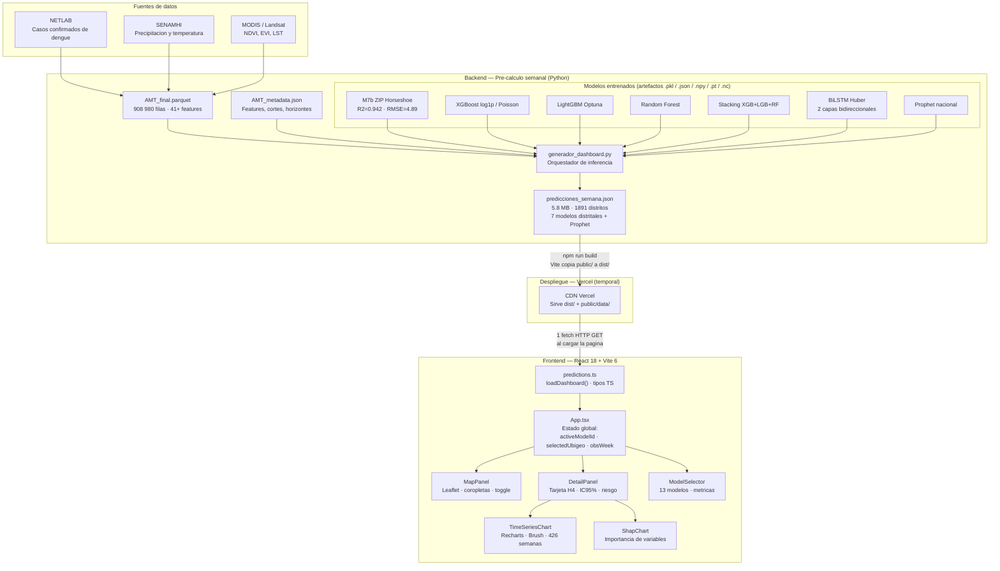
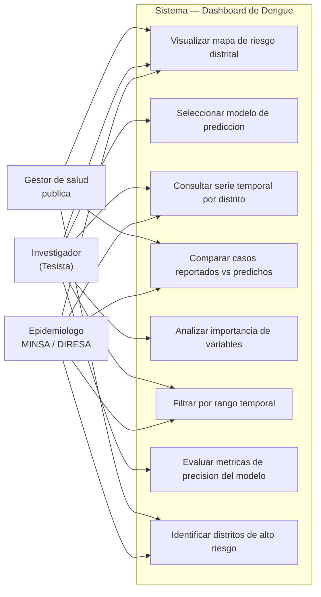
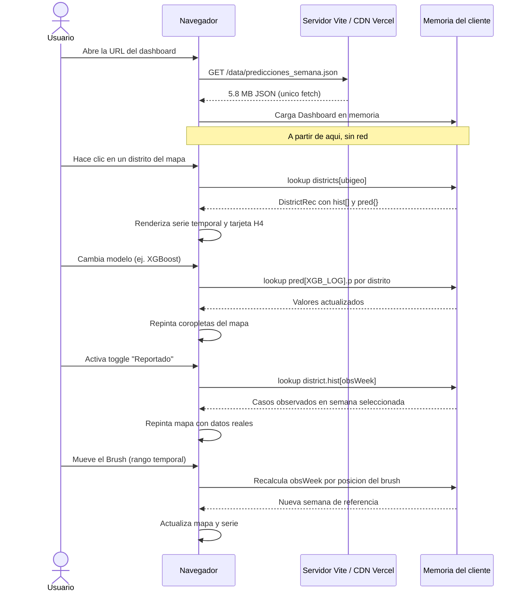
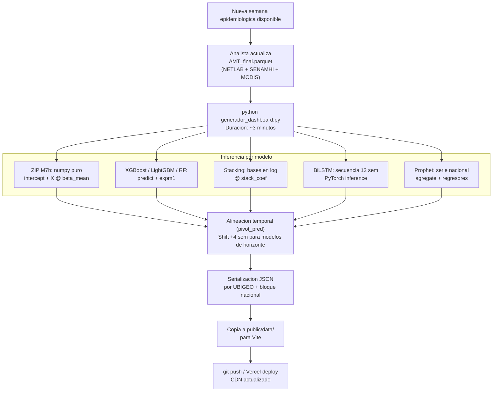
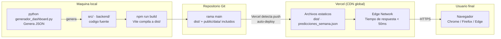

# Arquitectura del Sistema — Dashboard de Predicción de Dengue

**Proyecto:** Tesis PUCP — Predicción de brotes epidemiológicos de dengue a nivel distrital  
**Alcance:** 1 891 distritos · 426 semanas epidemiológicas · Perú 2018–2026

---

## 1. Descripcion del sistema

Sistema de visualización interactiva para la predicción de casos de dengue por semana epidemiológica y distrito. Combina modelos de machine learning (ZIP Bayesiano, XGBoost, LightGBM, Random Forest, BiLSTM, Prophet) con un mapa coroplético distrital y series temporales desde 2018.

---

## 2. Atributos de calidad

| Atributo | Descripcion | Escenario de validacion |
|----------|-------------|------------------------|
| **Rendimiento** | Toda interaccion (cambio de modelo, seleccion de distrito, rango temporal) responde en menos de 100 ms | Un solo `fetch` al inicio; cambios son lookups en memoria RAM |
| **Disponibilidad** | Sin dependencia de servidor en tiempo de ejecucion | JSON estatico servido por CDN (Vercel); sin base de datos ni API activa |
| **Mantenibilidad** | Actualizacion semanal reducida a re-ejecutar un script Python | Pipeline encapsulado en `generador_dashboard.py`; frontend no cambia |
| **Portabilidad** | Ejecutable en cualquier hosting estatico | Vite genera artefactos `dist/` autocontenidos; sin runtime de servidor |
| **Exactitud** | Predicciones distritales con correlacion real/predicho >= 0.93 (modelo M7b) | Validado en semana de referencia SE11/2026 contra casos NETLAB |
| **Escalabilidad** | Agregar nuevo modelo = agregar columna al JSON; el frontend lo detecta sin modificacion | `models[]` dinamico; componentes usan `activeModelId` como clave |
| **Usabilidad** | Usuario no epidemiologo puede interpretar riesgo sin leer valores numericos | Escala semantica: sin riesgo / bajo / moderado / alto / muy alto con colormap YlOrBr |
| **Trazabilidad** | Cada prediccion es atribuible a un modelo, horizonte y semana especifica | Metadatos `meta.semana_ref`, `meta.horizonte_real`, `model.id` en el JSON |

---

## 3. Diagrama de arquitectura — Conexion frontend y backend

---

## 4. Diagrama de casos de uso

---

## 5. Diagrama de flujo de uso

---

## 6. Flujo del pipeline de actualizacion semanal

---

## 7. Despliegue en Vercel (temporal)

El sistema se despliega como sitio estatico en Vercel durante la fase de evaluacion de la tesis.

**Caracteristicas del despliegue:**

| Parametro | Valor |
|-----------|-------|
| Tipo de hosting | Estatico (sin servidor) |
| Tiempo de build | < 30 segundos (Vite) |
| Actualizacion | Re-deploy manual post-pipeline Python |
| Costo | Plan gratuito Vercel (hobby) |
| Dominio | `*.vercel.app` (temporal para tesis) |
| HTTPS | Automatico via Vercel |
| Cache | CDN distribuido; JSON con `Cache-Control` configurable |

---

## 8. Stack tecnologico completo

| Capa | Tecnologia | Version | Funcion |
|------|-----------|---------|---------|
| Framework UI | React | 18 | Componentes y estado reactivo |
| Build tool | Vite | 6 | Dev server, bundler, sirve `public/` |
| Lenguaje | TypeScript | 5 | Tipado estatico del JSON |
| Mapas | Leaflet / react-leaflet | — | Coropletas distritales, click, zoom |
| Graficos | Recharts | — | Serie temporal, Brush, barras SHAP |
| Estilos | Tailwind CSS | 3 | Utility-first, sin CSS personalizado |
| Datos geo | TopoJSON INEI 2025 | — | Geometria 1 891 distritos, clave UBIGEO |
| Backend ML | Python 3.11 | — | Pipeline de pre-calculo |
| Modelos | sklearn 1.6.1 / XGBoost / LightGBM / PyTorch / Prophet | — | Inferencia de 13 modelos |
| Datos fuente | Parquet (pandas) | — | AMT_final.parquet, 908 980 filas |
| Despliegue | Vercel | — | Hosting estatico CDN global |

---

## 9. Decisiones arquitectonicas

| Decision | Alternativa considerada | Razon de eleccion |
|----------|------------------------|-------------------|
| JSON estatico pre-calculado | API REST en tiempo real | Sin servidor dedicado; 3 min de inferencia es inaceptable por request |
| Un solo fetch al inicio | Fetch por interaccion | Lookups en memoria = 100x mas rapido que red |
| Vite sin SSR | Next.js con SSR | No se requiere renderizado en servidor; SPA es suficiente |
| ColorBrewer YlOrBr | Escala fria azul | La escala azul hacia parecer "cero" a distritos con transmision moderada |
| Modelo M7b como default | Seleccion manual siempre | Mejor R2 (0.942); usuario tiene punto de partida de alta calidad |
| TopoJSON INEI 2025 | GeoJSON / Shapefile | Peso 10 veces menor; clave UBIGEO estandarizada |
| Horizonte H4 unico activo | Multiples horizontes | Solo H4 esta entrenado y validado; los demas se deshabilitan para no engañar |
